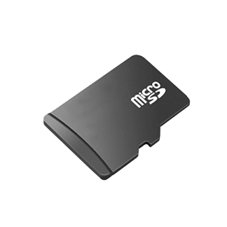
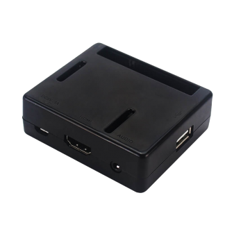

<p><a href="https://itunes.apple.com/app/royalbox-control-center-home/id1450861330"></a></p>

[![Android app on Google Play]](https://play.google.com/store/apps/details?id=com.gplexdb.royalboxremote)
[{:height="58px" width="206px"}](https://itunes.apple.com/app/royalbox-control-center-home/id1450861330)
[{:height="58px" width="206px"}](https://chrome.google.com/webstore/detail/royalbox/ifjhhhigdmmmlhppajdjifeeelodmang)

# ROYALBOX - SUPPORTED SITES
Casting like Chromecast - Works with all youtube-dl supported websites: http://rg3.github.io/youtube-dl/supportedsites.html (ABC, NBC, CBS, YouTube, etc...)

Built in Channels like Roku - For geo-restricted channels like BBC, iTV, ABC iView, SBS On Demand

Headless setup (No keyboard or mouuse required to setup your streaming device) you can simply plug it in your TV and a use the on-screen configuration guide to setup. 

Royalbox Remote App for iOS allows to stream any video you can watch on you iOS device to your Royalbox TV (Android version does not have this feature yet)

-------------------------------------------------------------------------------------------------------------------------
# PRE-CONFIGURED SD CARD or RASPBERRY PI A+

You can get a preloaded 16GB microSD card to plug into your own Raspberry Pi that you own or even get pre-configure Raspberry Pi A+ with a 16GB microSD card.

[{:height="58px" width="206px"}](https://www.amazon.com/dp/B07RWFQMKY?ref=myi_title_dp)
[{:height="58px" width="206px"}](https://www.amazon.com/dp/B07RWPKFK6?ref=myi_title_dp)

-------------------------------------------------------------------------------------------------------------------------
# PREREQUISITES

 - Raspberry Pi A+, B+, ZeroW with at least 16Gb SD card running Raspbian. ZeroW is not recommended. 
 - Wifi connection.
 - Television plugged into Raspberry Pi.
 - Computer, tablet or smartphone for controlling server.
 - Use the companion iOS app to Stream to Royalbox from iOS Device (optional)
 
# CREDITS

The project is built on 3 other projects from Github and some additional customization for the purpose of creating the Royalbox.

Streaming Engine - https://github.com/blissland/blissflixx
**NOTE:** Not all the channels from Blissflixx were added

Wifi Configuration - https://github.com/billz/raspap-webgui
This is used for the headless setup.  No need to have a keyboard or mouse.  You will connect to the Royalbox Ad-hock wireless network and setup your wifi connection

Chrome Extension & Android app - https://github.com/vincelwt/RaspberryCast
This code was used to add similar functionality to able to send youtube-dl supported web pages to your Royalbox to stream

-------------------------------------------------------------------------------------------------------------------------
# SCREENSHOTS

**TV SETUP and DASHBOARD**
<p align="center">


</p>

**TABLET/COMPUTER/MOBILE SETUP SCREEN**
<p alight="center">


</p>

**CASTING TO TV MOBILE**
<p align="center">


</p>

**CASTING TO TV CHROME**
<p align="center">


</p>

-------------------------------------------------------------------------------------------------------------------------
# HOW TO BUILD - DO IT YOURSELF 
# Step by step guide

**EASY OPTION**
You can download and copy the image to your own SD card using the following steps

1) Download the image <a href="https://www.gplexdb.net/Royalbox.img">here</a>
2) Step 1. Insert the SD Card to be Restored
Insert a blank (or used and nuked) SD card into the SD card reader on your Mac.

Step 2. Locate the SD Card to be Restored
Open Terminal and locate your SD Card, noting that the number may be different to that previously used, using the command:
```
diskutil list
```

Step 3. Unmount the SD Card
In Terminal, enter the following command:
```
diskutil unmountDisk /dev/disk2
```

Step 3. Format the SD Card
When you have identified your SD Card, enter the following command to format it as FAT16, in my case it’s /dev/disk2. Amend this as required for your circumstances:
```
sudo newfs_msdos -F 16 /dev/disk2
```

Step 4. Restore from a Cloned Disc Image
Locate the disc image, dmg, that you previously cloned. My example assumes that the dmg is on the Desktop. In Terminal, enter the following command ensuring that you identify the correct destination disc, in my example it’s /dev/disk2.
```
sudo dd if=~/Desktop/Royalbox.img of=/dev/disk2
```

Put the microSD into your Raspberry Pi with a keyboard attached.  When you get to the headless setup screen it the "options" (between the ctrl and alt keys) and that will bring up the startup menu, use the arrows keys to open up a Terminal window.
Now on the termianl window expand the file system
```
sudo raspi-config
```
and expand the file system in the Advanced Option to get your full 16 GB back.  Now reboot and your Pi is ready to start streaming.


----------------------------------------------------------------------------------------------------------------
**MANUAL DO IT YOURSELF***
**NOTE**:  This process modifies the filesystem and therefore should be used at own risk.

This repository has the full directory structure and files that were replaced/modified to build this device.  You will need to build this project once and then you can create and image of your Raspberry Pi and/or buy a SD card duplicator to sell your own SD cards or build your CPU's.


Login into your Raspberry Pi

1) Clone the project
```
pi@raspberrypi:~$ cd Downloads
pi@raspberrypi:~$ git clone https://github.com/omody/Royalbox.git
```

2) Move the home directory and replace your current home pi directory
```
pi@raspberrypi:~$ sudo mv ~/Downloads/home/* ~/home/.
```

3) Now configure blissflixx
```
pi@raspberrypi:~$ cd ~/blissflixx
pi@raspberrypi:~$ sudo chmod +x configure.sh
pi@raspberrypi:~$ sudo ./configure.sh
```

This will take about 20 mins to rebuild on a Pi B+.

4) Now lets do the headless setup, accept all the default suggestion
```
pi@raspberrypi:~$ wget -q https://git.io/voEUQ -O /tmp/raspap && bash /tmp/raspap
```

5) Now lets replace the headless configuration software that comes with our own custom one
```
pi@raspberrypi:~$ sudo mv /var/www/html /var/www/html_old
pi@raspberrypi:~$ sudo cp -r ~/Downloads/var/www /var/.
pi@raspberrypi:~$ chmod -R www-data:www-data /var/www
pi@raspberrypi:~$ sudo chown www-data:www-data /etc/wpa_supplicant/wpa_supplicant.conf
pi@raspberrypi:~$ sudo chmod 777 /etc/wpa_supplicant/wpa_supplicant.conf
pi@raspberrypi:~$ sudo chmod +x /home/pi/rpi-hdmi.sh
pi@raspberrypi:~$ sudo chmod +x /home/pi/scripts/startup.sh
pi@raspberrypi:~$ sudo chmod +x /home/pi/scripts/connect_to_wifi_royalbox.sh
pi@raspberrypi:~$ sudo chmod +x /home/pi/scripts/dhcp_rebooter.sh
pi@raspberrypi:~$ sudo chmod +x /home/pi/scripts/start_bliss.sh
pi@raspberrypi:~$ sudo chmod +x /home/pi/scripts/nightly_reboot.sh
```

6) Now lets configure the interfaces, webservers, cronjob and sudoer's to finish this up
```
pi@raspberrypi:~$ sudo cp -r ~/Downloads/etc /
pi@raspberrypi:~$ sudo cp -r ~/Downloads/boot /
pi@raspberrypi:~$ sudo cp -r ~/Downloads/usr /
pi@raspberrypi:~$ sudo visudo
```
Add the following lines to the end
```
www-data ALL=(ALL) NOPASSWD:/home/pi/scripts/connect_to_wifi_royalbox.sh
www-data ALL=(ALL) NOPASSWD:/home/pi/scripts/wifi_rebooter.sh
www-data ALL=(ALL) NOPASSWD:/home/pi/scripts/dhcp_rebooter.sh
www-data ALL=(ALL) NOPASSWD:/bin/cat /etc/hostname
www-data ALL=(ALL) NOPASSWD: /bin/bash, /sbin/iwlist, /usr/bin/timedatectl, /usr/bin/tvservice, /sbin/fping, /sbin/ifconfig
```
You can make modification using this reference
https://scribles.net/customizing-boot-up-screen-on-raspberry-pi/

I did the following:
Now get rid of the rainbow logo
```
pi@raspberrypi:~$ sudo vi /boot/cmdline.txt
```
Add the end of the file put a space and add:
```
quiet splash plymouth.ignore-serial-consoles logo.nologo
```
Here are brief explanations.
‘splash’ : enables splash image
‘quiet’ : disable boot message texts
‘plymouth.ignore-serial-consoles’ : not sure about this but seems it’s required when use Plymouth.
‘logo.nologo’ : removes Raspberry Pi logo in top left corner.

Note : Some might be there by default, but make sure if those exist.

Now lets add the cronjob for startup and make sure the system restarts processes if something crashes
```
pi@raspberrypi:~$ crontab < ~/Downloads/home/pi/setup_cronjobs.txt
```
Or you add them manually
```
*/3 * * * * /home/pi/scripts/wifi_rebooter.sh
*/10 * * * * /home/pi/scripts/dhcp_rebooter.sh
0 3 * * * /home/pi/scripts/nightly_reboot.sh
0/5 * * * * /home/pi/scripts/start_bliss.sh
0/15 * * * * /home/pi/scripts/startup.sh
@reboot /home/pi/scripts/dhcp_rebooter.sh
@reboot /home/pi/scripts/start_bliss.sh
```

Now reboot and if everything goes smoothly you can proceed with a headless setup for your Raspberry Pi (Royalbox).

